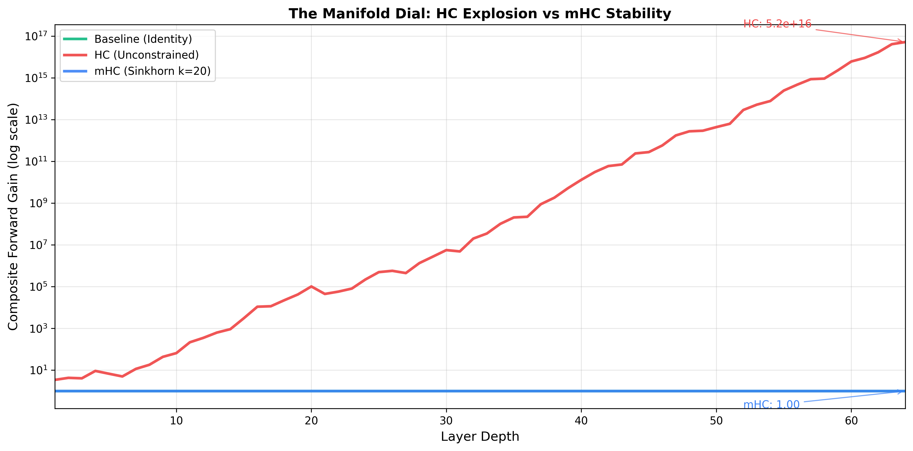

# Manifold Dial: Visualizing mHC Stability

[](https://bassrehab.github.io/mhc-visualizer/)
[](https://github.com/bassrehab/mhc-visualizer)
[](https://colab.research.google.com/github/bassrehab/mhc-visualizer/blob/main/notebook/mhc_exploration.ipynb)
[](python/tests)
[](LICENSE)

> Interactive visualization demonstrating why Manifold-Constrained Hyper-Connections (mHC) stabilize deep neural networks.

**Author:** [Subhadip Mitra](https://github.com/bassrehab) (<contact@subhadipmitra.com>)



## What This Shows

DeepSeek's [mHC paper](https://arxiv.org/abs/2512.24880) reveals a critical insight:

| Method | Behavior | Composite Gain @ Depth 64 |
|--------|----------|---------------------------|
| **Baseline** | Identity skip connections | 1.0 |
| **HC** | Unconstrained mixing matrices | 10^16 (explosion!) |
| **mHC** | Doubly stochastic matrices | ~1.0 (stable!) |

**The Problem:** Hyper-Connections use learnable matrices to mix residual streams. When signals propagate through many layers, these matrices compound their gains exponentially—leading to catastrophic instability.

**The Solution:** mHC projects mixing matrices onto the *Birkhoff polytope* (set of doubly stochastic matrices) using Sinkhorn-Knopp. Since doubly stochastic matrices are closed under multiplication, signals stay bounded regardless of depth.

**The Manifold Dial:** Our visualization lets you sweep Sinkhorn iterations from 0→30 and watch the transition from explosive HC behavior to stable mHC behavior in real-time.

## Quick Start

### Interactive Demo

```bash
cd react-demo
npm install
npm run dev
# Open http://localhost:5173
```

### Python Exploration

```bash
cd python
pip install -r requirements.txt
pytest tests/  # Run 32 tests
python generate_plots.py  # Generate figures
```

### Colab Notebook

[](https://colab.research.google.com/github/bassrehab/mhc-visualizer/blob/main/notebook/mhc_exploration.ipynb)

Run the full exploration in your browser—no setup required.

### Marimo Notebook

```bash
pip install marimo
marimo run notebook/mhc_exploration.py
```

A reactive Python notebook with real-time sliders and instant feedback-no cell re-execution needed.

## Key Visualizations

### The Manifold Dial

The core interactive element: a slider controlling Sinkhorn iterations (0-30).

- **k=0:** No projection → HC-like behavior → explosion
- **k=5:** Partial projection → partial stability
- **k=20:** Full projection → mHC stability

### Composite Gain Plot

Shows forward gain through the composite mapping $H_L \cdot H_{L-1} \cdot ... \cdot H_1$:
- **Green (Baseline):** Flat at 1 (identity matrices)
- **Red (HC):** Exponential explosion
- **Blue (mHC):** Bounded near 1

### Matrix Heatmaps

Side-by-side comparison of HC vs mHC residual matrices:
- Row/column sums displayed
- Visual confirmation of doubly stochastic property

## The Mathematics

### Why Doubly Stochastic?

A matrix is doubly stochastic if:
1. All entries are non-negative
2. All rows sum to 1
3. All columns sum to 1

Key properties:
- **Spectral norm ≤ 1:** Cannot amplify signals
- **Closed under multiplication:** Products remain doubly stochastic
- **Birkhoff-von Neumann:** Convex combination of permutation matrices

### Sinkhorn-Knopp Algorithm

```python
def sinkhorn_knopp(M, iterations=20):
    P = exp(M)  # Ensure positive
    for _ in range(iterations):
        P = P / P.sum(axis=1, keepdims=True)  # Normalize rows
        P = P / P.sum(axis=0, keepdims=True)  # Normalize cols
    return P
```

This iterative algorithm projects any matrix onto the doubly stochastic manifold.

## Use in Your Code

### Python

```python
from mhc import sinkhorn_knopp, run_comparison

# Project a matrix
H_mhc = sinkhorn_knopp(random_matrix, iterations=20)

# Run full simulation
results = run_comparison(depth=64, n=4, sinkhorn_iters=20, seed=42)
print(f"HC final gain: {results['hc']['composite'][-1]['forward_gain']:.2e}")
print(f"mHC final gain: {results['mhc']['composite'][-1]['forward_gain']:.2f}")
```

### PyTorch

```python
from mhc import mHCResidual, mHCBlock

# Drop-in residual replacement
residual = mHCResidual(dim=512, n_streams=4, sinkhorn_iters=20)
output = residual(hidden_states, layer_output)

# Full transformer block
block = mHCBlock(dim=512, n_heads=8, n_streams=4)
output = block(x)
```

## Repository Structure

```
mhc-visualizer/
├── python/
│   ├── mhc/
│   │   ├── sinkhorn.py      # Sinkhorn-Knopp implementation
│   │   ├── metrics.py       # Stability metrics
│   │   ├── simulation.py    # Depth simulation
│   │   └── torch_module.py  # PyTorch modules
│   ├── tests/               # 32 unit tests
│   ├── examples/            # Usage examples
│   └── generate_plots.py    # Figure generation
├── react-demo/
│   ├── src/
│   │   ├── components/      # React components
│   │   └── lib/             # TypeScript core library
│   └── dist-embed/          # Embeddable widget
└── notebook/
    ├── mhc_exploration.ipynb  # Colab notebook
    └── mhc_exploration.py     # Marimo reactive notebook
```

## Requirements

### Python
- Python 3.8+
- NumPy
- PyTorch (optional, for neural network modules)
- Matplotlib (for plot generation)
- pytest (for testing)

### React Demo
- Node.js 18+
- npm or yarn

## References

- **mHC Paper:** [DeepSeek-AI, arXiv:2512.24880](https://arxiv.org/abs/2512.24880)
- **Original HC Paper:** [Hyper-Connections](https://arxiv.org/abs/2409.19606)
- **Sinkhorn-Knopp:** Sinkhorn, R., & Knopp, P. (1967). "Concerning nonnegative matrices and doubly stochastic matrices"
- **Birkhoff-von Neumann:** Birkhoff, G. (1946). "Three observations on linear algebra"

## License

MIT License - see [LICENSE](LICENSE) for details.

## Acknowledgments

Based on research by DeepSeek-AI. This visualization was built to make their insights more accessible and interactive.

---

**Built by [Subhadip Mitra](https://github.com/bassrehab)** | [Blog Post](https://subhadipmitra.com/blog/2026/deepseek-mhc-manifold-constrained-hyper-connections/) | [Colab Notebook](https://colab.research.google.com/github/bassrehab/mhc-visualizer/blob/main/notebook/mhc_exploration.ipynb)
